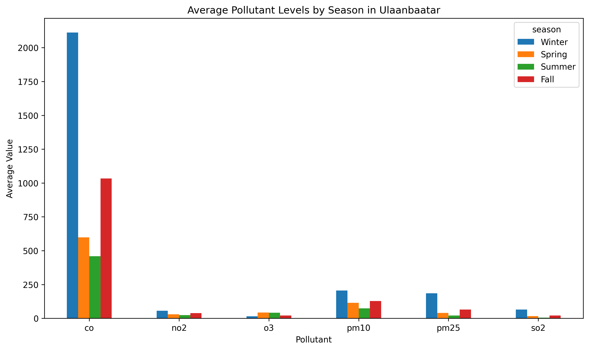
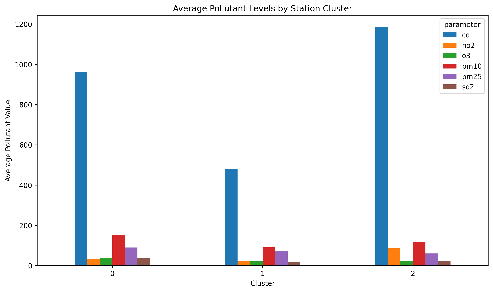
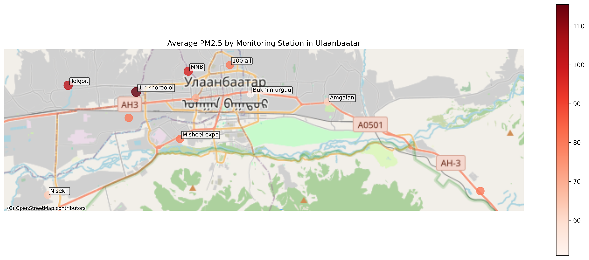
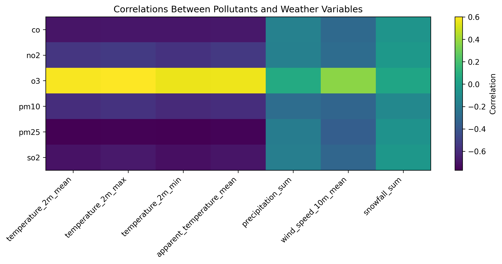
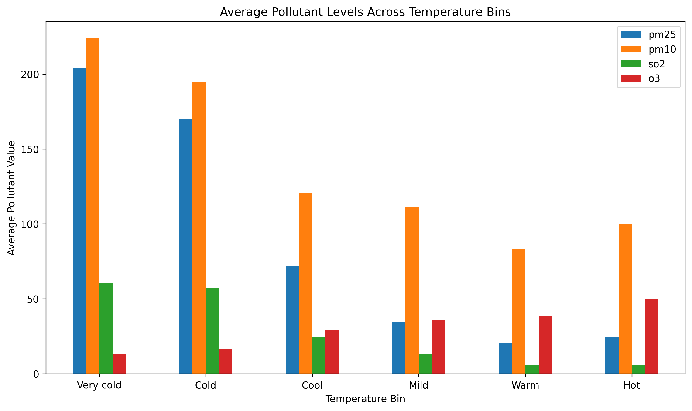

# Air Pollution in Ulaanbaatar, Mongolia

Air pollution in Ulaanbaatar is one of the city’s most serious environmental problems, especially during the winter. As I grew up in Ulaanbaatar, I experienced this issue firsthand. For this project, I wanted to look at that problem through data, instead of only talking about it in general terms. I used daily air quality data and daily weather data from 2016 to 2019 to study three main questions: how pollution changes over time, how it differs across monitoring stations, and how weather conditions are associated with pollution levels.

This page is a summary of the project. The full notebooks, datasets, and figures are available in the main repository.

[View the full GitHub repository](./)

---

## Why this topic matters

I chose this topic because it is personally meaningful to me, but it also turned out to be a strong data science topic. Ulaanbaatar is often discussed as a city with severe winter air pollution, so it was interesting to see whether the data would show the same pattern clearly, which pollutants were most affected, and whether pollution looked the same across the whole city.

One thing that made this project especially interesting is that air pollution is not just one number. Different pollutants behave differently, and they may respond to season, location, and weather in different ways. That made it possible to go beyond one simple chart and build a fuller analysis.

---

## The data I used

This project used three main sources of data:

- OpenAQ API data for air quality monitoring stations in Ulaanbaatar
- Daily weather data for Ulaanbaatar, including temperature, precipitation, wind speed, and snowfall
- Approximate station coordinates used for a supporting station map

The air data included six pollutants:

- CO
- NO2
- O3
- PM10
- PM2.5
- SO2

The raw data could not be analyzed immediately. I first had to clean dates, organize the air measurements into useful city-level and station-level summaries, and merge the air data with daily weather variables. I kept that work in a separate notebook so the final notebook could focus on analysis and interpretation.

---

## What I wanted to find out

This project was built around three main questions:

1. How do major air pollutants in Ulaanbaatar vary across seasons and years?
2. Which monitoring stations show the worst pollution levels, and do stations group into different pollution profiles?
3. How are daily weather conditions associated with air pollution levels?

Together, these questions made it possible to look at the problem from several angles instead of only describing one trend.

---

## Finding 1: Pollution is much worse in winter

The clearest pattern in the project was that most major pollutants rise sharply during winter. This means the pollution problem is not evenly spread across the year. Instead, it becomes much more severe during colder months.

This seasonal chart shows that SO2, PM2.5, and CO all become much higher in winter than in warmer seasons. PM10 and NO2 also rise in winter, although less dramatically. O3 stands out because it behaves differently from the other pollutants and is higher in warmer conditions.

This shows that “air pollution” is not one single pattern. Some pollutants seem closely tied to cold season conditions, while others, like O3, move in the opposite direction.

The monthly PM2.5 trend makes the winter pattern even more obvious.

Instead of showing one isolated spike, the PM2.5 graph shows repeated winter peaks across the full study period. In other words, this is not a one-time event. The same seasonal pattern keeps appearing again and again.

The yearly averages add another layer to the story.

Several pollutants decline over the four years, but they do not all change in the same way. PM2.5 and SO2 both drop noticeably across the study period, while PM10 does not show the same steady improvement. This means the long-term trend is more complicated than simply saying the city got better every year.

Overall, the first section suggests two important things: pollution in Ulaanbaatar is strongly seasonal, and different pollutants do not all follow the same yearly path.

---

## Finding 2: Pollution is not evenly distributed across the city

Citywide averages are useful, but they can hide local differences. To see whether all monitoring stations looked similar, I compared station-level pollution patterns and then grouped stations using k-means clustering.

The station cluster figure suggests that the monitoring stations do not all share the same pollution profile. Some stations cluster together because they have generally higher particulate and gas pollution, while others form groups with lower overall values or a different mix of pollutants.

The findings suggest that different parts of Ulaanbaatar may be experiencing different kinds of air quality conditions rather than one single uniform citywide pattern.

I also mapped average PM2.5 levels by station using approximate station coordinates.

This map makes the station differences easier to understand geographically. Some stations, such as Tolgoit and 1-r khoroolol, stand out with higher average PM2.5 levels, while others are noticeably lower. Even though the coordinates are only approximate, the map still helps connect the station results back to actual parts of the city.

So the second main takeaway is that air pollution in Ulaanbaatar is not only a seasonal issue. It is also spatially uneven, with some monitored areas showing consistently worse particulate pollution than others.

---

## Finding 3: Cold weather is strongly associated with worse pollution

After looking at time patterns and station differences, I wanted to understand whether daily weather conditions were associated with changes in pollution. To do that, I merged the daily city-level air data with weather data and compared pollutants with temperature, precipitation, snowfall, and wind speed.

The correlation heatmap gives the first overview.

The most important thing here is that temperature stands out much more strongly than the other weather variables. For most pollutants, especially PM2.5, SO2, and CO, the relationship with temperature is strongly negative. That means colder days tend to line up with worse pollution.

O3 again behaves differently. Instead of increasing on colder days, it tends to be higher on warmer days. That matches what already appeared in the seasonal analysis.

To make the temperature effect easier to understand, I also grouped days into temperature ranges and compared average pollution levels across those groups.

This figure shows that PM2.5, PM10, and SO2 are highest on the coldest days and generally decrease as temperatures rise. O3 moves in the opposite direction, increasing on warmer days. So the relationship is not subtle. The change from very cold conditions to warmer conditions is associated with a major drop in several pollutants.

I also fit a simple multiple linear regression model using PM2.5 as the response variable and temperature, wind speed, precipitation, and snowfall as predictors. The regression supported the earlier results by showing that temperature remained the strongest weather-related variable even after the other weather variables were considered at the same time. Wind speed also showed a meaningful negative relationship with PM2.5, while precipitation was much less important in this model.

So the third big takeaway is that cold and relatively stagnant conditions are strongly associated with worse pollution in Ulaanbaatar.

---

## Techniques I used

This project used several data science techniques:

- data cleaning and wrangling
- aggregation into city-level and station-level summary tables
- k-means clustering
- geographic visualization with station points
- correlation analysis
- multiple linear regression

A big new part of this project was the data wrangling process, especially because the raw data was more complicated than I expected. A lot of the work was not just cleaning the data, but first figuring out how to even get the right data out of the API. I ran into failed requests, had to debug the structure of the responses, and realized that some of the values I needed were nested inside other fields instead of being ready to use. So a lot of the project involved working through those problems, unpacking the nested data, and then reorganizing everything into summary tables that I could actually analyze.

I also had to install and use some new libraries, such as one for the geographic map. I decided to include these methods because I wanted the project to do more than just show a few charts. I wanted it to look at the pollution problem across time, across different parts of the city, and in relation to weather conditions.

---

## What surprised me

The biggest surprise was how strong the winter effect really was once I calculated it. I had lived in Ulaanbaatar long enough to have certain expectations, but the difference was more dramatic than I thought, especially for PM2.5, SO2, and CO.

Another thing that stood out was how consistently O3 behaved differently from the other pollutants. That pattern came up in the seasonal charts, the correlations, and the temperature-bin analysis, so it ended up being one of the most interesting contrasts in the project.

---

## What was challenging

The hardest part of the project was not making the charts. It was getting the data into a form where the analysis made sense. The raw air data had to be cleaned, summarized, and reorganized before I could even start answering the project questions.

Another challenge was that not every station measured every pollutant. That meant I had to be careful in the station analysis and make sure I was not misleadingly comparing incomplete station profiles.

---

## Limitations

This project has a few important limitations. Not every monitoring station measured every pollutant, the station map uses approximate coordinates rather than exact official station boundaries, and the weather analysis shows associations rather than proof of causation. Even with those limits, the data was still strong enough to show clear patterns across time, stations, and weather conditions.

---

## Final takeaway

Overall, this project shows that air pollution in Ulaanbaatar is shaped by three big factors at once: strong winter seasonality, spatial differences, and weather conditions, especially temperature. Ulaanbaatar does not just have “bad air” in a general sense. The severity changes across the year, it differs across different stations, and it is strongly associated with colder conditions.

That is what made this project interesting. The data did not just confirm that pollution exists. It helped show how the problem changes over time, where it appears more strongly, and which environmental conditions are most closely connected to it.

---

## Credits

This project used course materials, DataCamp modules, and outside tools for debugging and workflow support. ChatGPT was used at some points to help with coding issues.
You can find the full notebooks, datasets, and figures in the repository linked at the top of this page.
